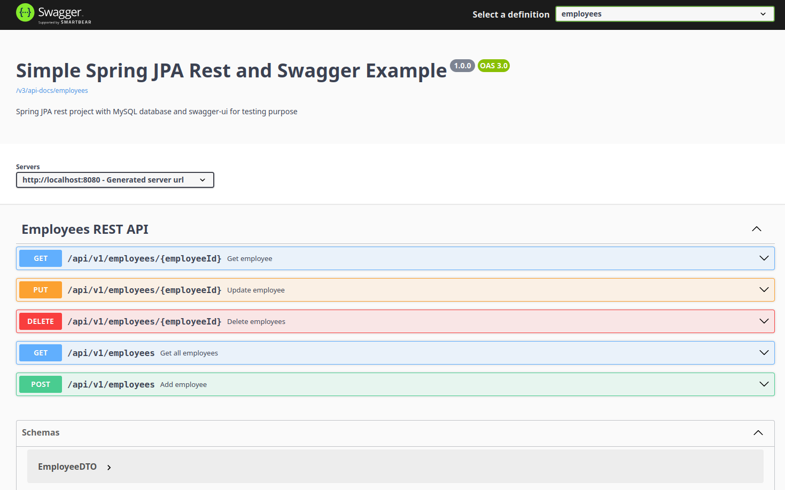
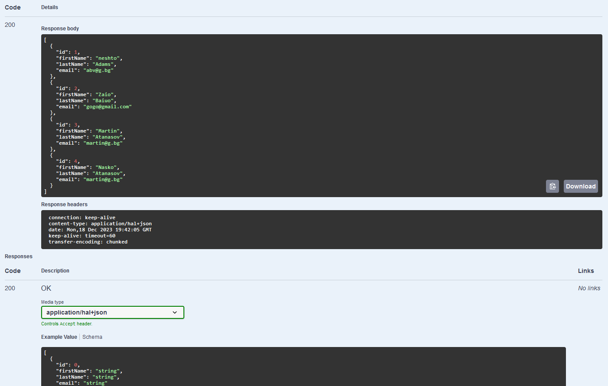
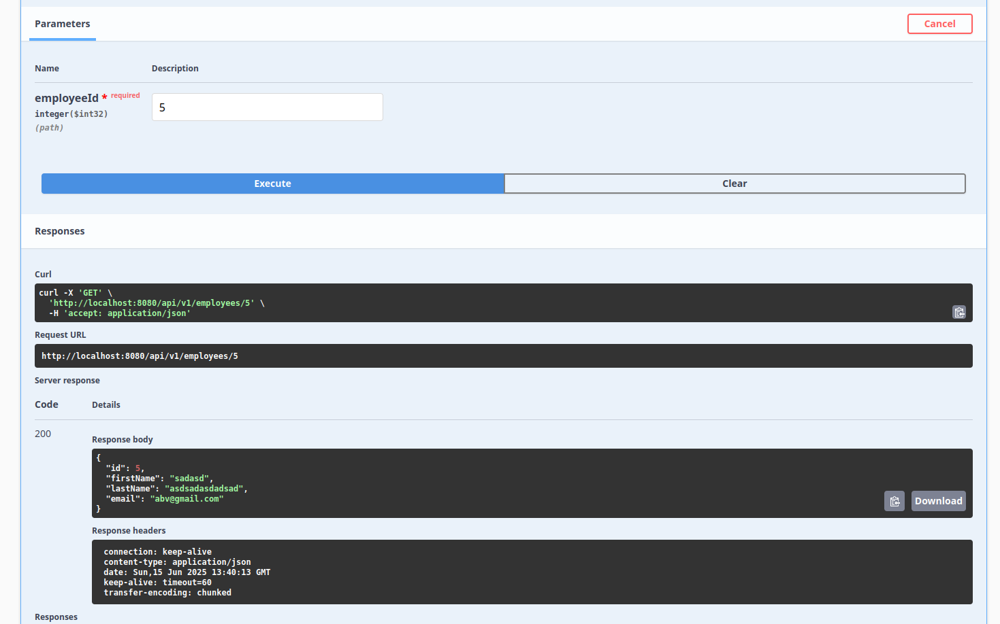
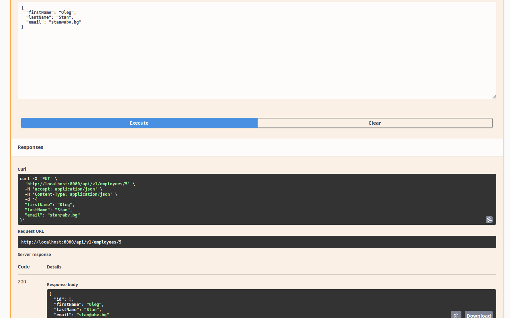
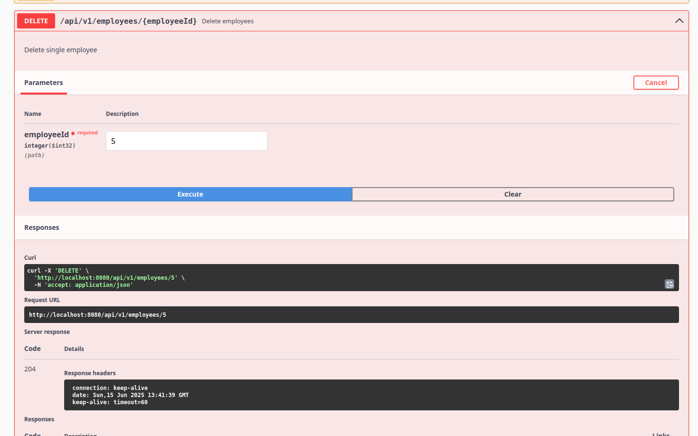
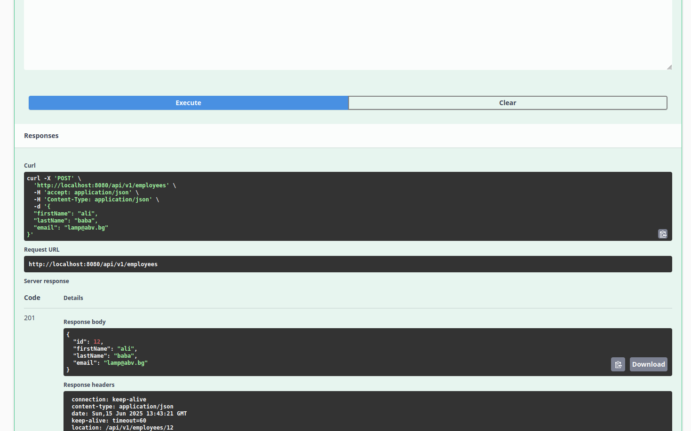
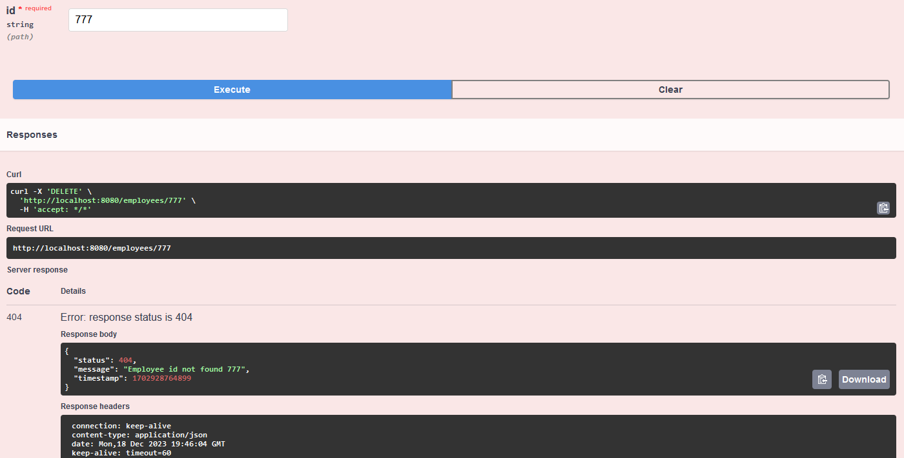

# Simple Spring JPA Rest and Swagger Example

This is Spring JPA rest project with MySQL database and swagger-ui for testing purpose.
Spring boot version: 3.2.0

Software requires: 
1. MySQL Server(not included in the project, for more details check URL: [MySQL community server](https://dev.mysql.com/downloads/mysql));
2. Java 17 LTS or latest;

Useful tools(optional):
1. MySQL Workbench user interface tool URL: [MySQL Workbench](https://dev.mysql.com/downloads/workbench)
2. Multiple DB user interface tool URL: [DBever - Universal Database Tool](https://dbeaver.io/download)

Project setup:

1. Install MySQL Server;
2. Install Java 17+ LTS
3. Create new user in the DB with all privilegies by runing this script in the MySQL Workbench:

	CREATE USER 'springuser'@'localhost' IDENTIFIED BY 'springuser';

	GRANT ALL PRIVILEGES ON * . * TO 'springuser'@'localhost';

4. Before running the project change configuration "spring.jpa.hibernate.ddl-auto=create" in application.properties
5. Run the project and load swagger-ui with this custom link [/swagger](http://localhost:8080/swagger)
6. Available endpoints: [REST endpoints](http://localhost:8080/api/v1/employees)



<table>
  <tr>
    <td></td>
    <td></td>
    <td></td>
  </tr>
  <tr>
    <td></td>
    <td></td>
    <td></td>
  </tr>
 </table>


## Test timeouts

### Stop MySQL service after backend is up then run some requests
```bash
sudo systemctl stop mysql
```

### Start MySQL service
```bash
sudo systemctl start mysql
```


